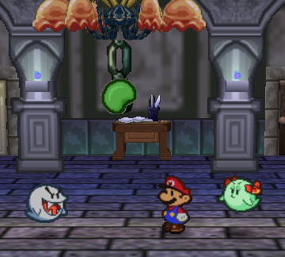
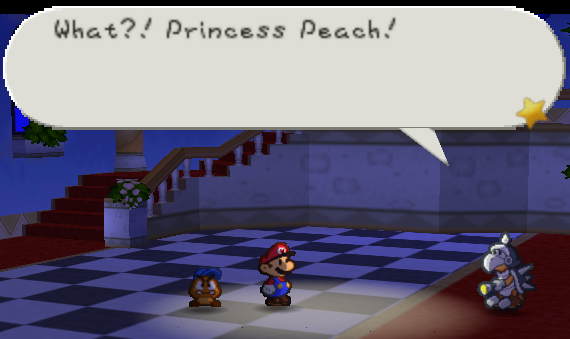
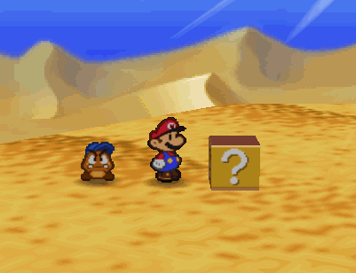
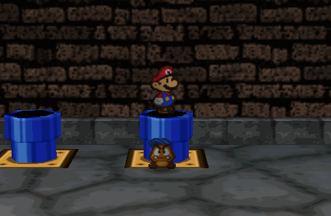
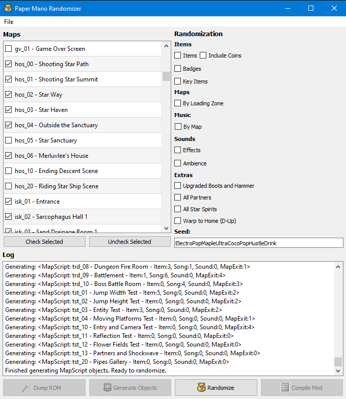

#  PaperMarioRandomizer 

Version 0.4 is located in the /Release folder

 
 

A randomizer for Paper Mario 64 using Star Rod (a modding tool by Clover) behind the scenes. It works by utilizing Star Rod to dump ROM content supplied by the user, which is parsed through in text format to create data structures representing in-game objects like items, badges, key items, songs, sounds, loading zones, and so forth. These data structures are randomized and placed back into a form Star Rod recognizes, which can then be used to compile a randomized version of the ROM supplied by the user.
 
 Functional Features:
 - Item/Badge/KeyItem randomization
 - Song/Sound randomization
 - Loading Zone randomization (by all loading zones)
 - Ability to select which maps are included in randomization
 - Quality of Life options:
   - Action commands
   - Upgraded boots and hammer
   - All partners
   - All star spirits
   - "Warp to Home" ability, which allows Mario to travel to the warp pipe in Toad Town at any time

 Planned Features:
 - Loading Zone randomization (by area, e.g. only exits that lead to new areas would be randomized)
 - Smart Key Item randomization (implementing logic to prevent soft-locks)
 - Graphics randomization
 - Randomization stability (blacklisting certain maps and preventing crashes)
 
 How to Contribute:
 - Set up virtual environment with pipenv.
 - Running with Python: Run "pipenv run python main.py".
 - Editing GUI: Run "run_qt_designer.bat". This will open QtDesigner. Save changes or additions to the /ui folder.
 - Building executable: Run "build_exe.bat". The resulting executable will be in the /Release folder.
 - Note: Full release package must include StarRod folder in the same path as the executable.

 
 
 
 
